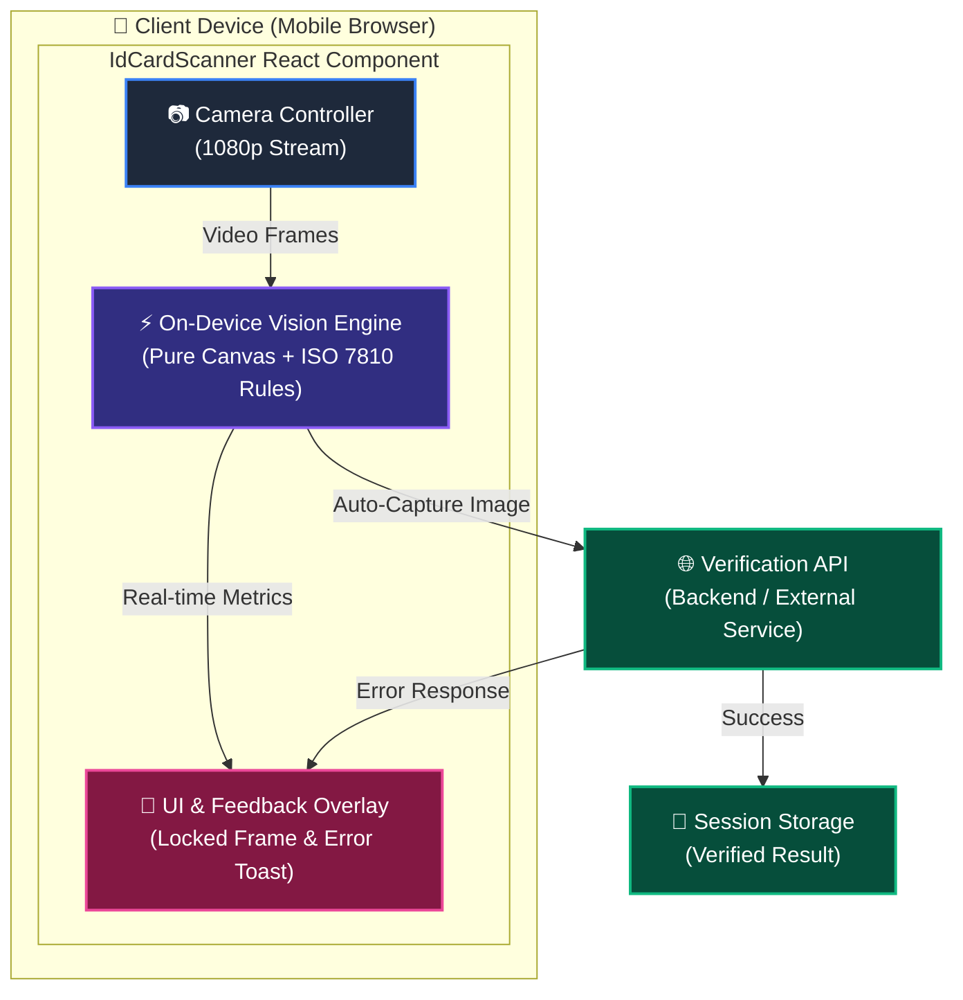
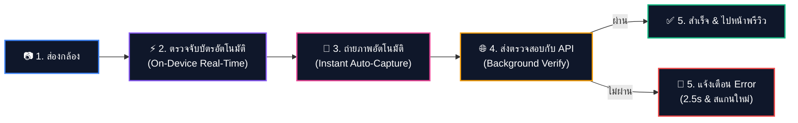
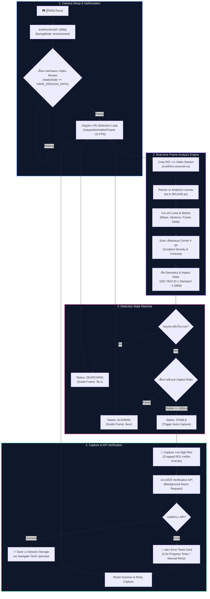
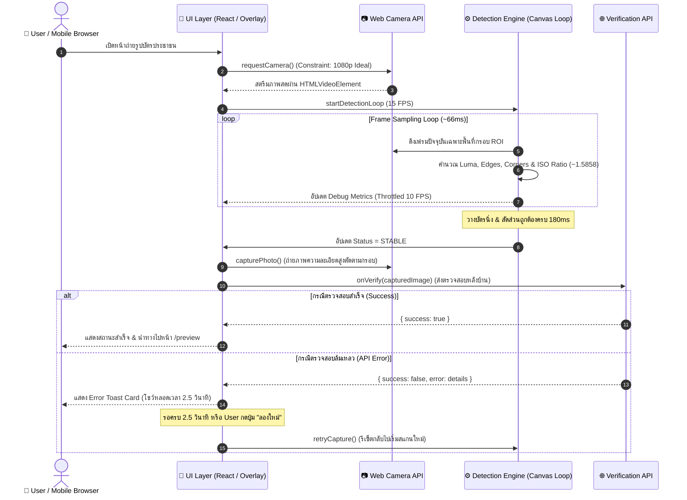

# 🎙️ Presentation Script & Demo Guide: ID Card Scanner POC

เอกสารคู่มือสำหรับการนำเสนอ (Presentation Script) และการสาธิต (Live Demo) สำหรับโปรเจกต์ **ID Card Auto Scanner & Verification System**

---

## 📋 Table of Contents
1. [🎯 Executive Summary & Pitch (เกริ่นนำ)](#1--executive-summary--pitch-เกริ่นนำ)
2. [🎬 Step-by-Step Demo Script (สคริปต์การนำเสนอ)](#2--step-by-step-demo-script-สคริปต์การนำเสนอ)
3. [📊 Architecture & Sequence Diagrams (Mermaid)](#3--architecture--sequence-diagrams-mermaid)
4. [🧠 Technical Deep-Dive (รายละเอียดเทคนิค)](#4--technical-deep-dive-รายละเอียดเทคนิค)
5. [💬 Q&A Cheat Sheet (เตรียมตอบคำถาม)](#5--qa-cheat-sheet-เตรียมตอบคำถาม)

---

## 1. 🎯 Executive Summary & Pitch (เกริ่นนำ)

> **คำพูดแนะนำโปรเจกต์ (30 วินาที):**
> *"สวัสดีครับ วันนี้เราจะมาเดโมโปรเจกต์ **ID Card Auto Scanner & Real-time Verification System** ซึ่งเป็นระบบตรวจจับและถ่ายรูปบัตรประชาชนอัตโนมัติบนเว็บเบราว์เซอร์ โดยไม่ต้องพึ่งพา Library ML ขนาดใหญ่ ทำให้โหลดได้เร็วในมิลลิวินาที ภาพสตรีมลื่นไหล 60 FPS บนมือถือทุกรุ่น และเมื่อตรวจพบตำแหน่งบัตรที่ถูกต้อง ระบบจะทำการถ่ายภาพและส่งยืนยันตัวตนกับ API เบื้องหลังทันที พร้อมระบบแจ้งเตือน Error ที่ชัดเจนครับ"*

---

## 2. 🎬 Step-by-Step Demo Script (สคริปต์การนำเสนอ)

### 📍 Scene 1: Camera Startup & Layout Stability (การเปิดกล้องและความนิ่งของ UI)
- **สิ่งที่จะโชว์:** เปิดหน้าเว็บ ➔ กล้องเปิดทันที ➔ กรอบนิ่ง ไม่กระตุก ไม่ขยับ
- **พูดตามสคริปต์:**
  > *"เมื่อเปิดหน้าแอปขึ้นมา กล้องหลังจะถูกเรียกใช้งานทันทีที่ความละเอียด **1080p Full HD** โดยไม่มีอาการกระตุกตอนเริ่มต้น เนื่องจากเราปรับการรอให้กล้องพร้อมเต็มที่ก่อนเริ่มสแกน*
  > *และสังเกตว่ากรอบสแกนบัตร (Card Guide Frame) จะล็อคตำแหน่งอยู่กับที่ 100% ไม่มีการขยับเด้งขึ้นลงเวลาข้อมูลเปลี่ยน ทำให้ผู้ใช้ไม่งง"*

### 📍 Scene 2: Real-time Frame Analysis & Debug Metrics (การสแกนสด)
- **สิ่งที่จะโชว์:** ส่องกล้องไปที่บัตร ➔ สีสแกนเนอร์เปลี่ยนจากขาวเป็นแดง ➔ ค่า Debug ขยับสด
- **พูดตามสคริปต์:**
  > *"ขณะที่ผู้ใช้นำบัตรประชาชนเข้ามาในกรอบ ระบบจะดึงพิกเซลภาพเฉพาะพื้นที่กรอบไปย่อเหลือ 381x240 และคำนวณ 4 อย่างพร้อมกันทุกๆ เฟรม:*
  > 1. *ความสว่างและความหนาแน่นของเส้นขอบ (Edge Density)*
  > 2. *ความสว่างของมุมบัตรทั้ง 4 มุม (Corner Contrast)*
  > 3. *อัตราส่วนภาพตามมาตรฐาน ISO 7810 ID-1 (~1.5858)*
  > 4. *ความนิ่งของมือผู้ใช้ (Motion Variance)*
  > *เมื่อเข้าเงื่อนไขเบื้องต้น สถานะจะเปลี่ยนเป็น **DETECTED/ALIGNING** และกรอบจะเปลี่ยนเป็นสีแดงสดทันที"*

### 📍 Scene 3: Auto-Capture & Instant Verification (ถ่ายอัตโนมัติ & ส่ง API)
- **สิ่งที่จะโชว์:** บัตรวางตรงและนิ่ง ➔ ถ่ายรูปทันที ➔ โชว์ไฟสถานะบันทึกภาพ
- **พูดตามสคริปต์:**
  > *"ทันทีที่บัตรวางตรงและนิ่งครบตามเงื่อนไข ระบบจะทริกเกอร์ **Auto-Capture ทันที (0ms delay)** ตัดเอาเฉพาะภาพบัตรประชาชนความละเอียดสูง และส่งไปตรวจสอบกับ API เบื้องหลังแบบ Async โดยผู้ใช้ไม่ต้องกดปุ่มใดๆ"*

### 📍 Scene 4: Readable Error Toast & Recovery UX (การแจ้งเตือนเมื่อเกิด Error)
- **สิ่งที่จะโชว์:** API ตอบกลับว่าภาพไม่ชัด ➔ มีกล่องสีแดงแจ้งเตือนโชว์ขึ้นมาพร้อมหลอดนับถอยหลัง 2.5s ➔ กดปุ่มลองใหม่
- **พูดตามสคริปต์:**
  > *"ในกรณีที่ API ตรวจสอบแล้วพบว่าภาพไม่ชัดเจน ระบบจะมี **Error Notification Toast** ลอยขึ้นมา โดยกล่องนี้จะค้างอยู่ **2.5 วินาที** พร้อมหลอดเวลานับถอยหลัง เพื่อให้ลูกค้ามีเวลาอ่านข้อความและเข้าใจปัญหาอย่างชัดเจน ก่อนจะรีเซ็ตกลับไปเริ่มสแกนใหม่อัตโนมัติ หรือถ้าลูกค้าอ่านไวก็สามารถกดปุ่ม **'ลองใหม่'** เพื่อข้ามเวลาได้ทันทีครับ"*

---

## 3. 📊 Architecture & Sequence Diagrams (Mermaid)

### A. High-Level Architecture (โครงสร้างระดับสูง)

### B. High-Level User Flow (ขั้นตอนการทำงานหลัก)

### C. Detailed System Pipeline Flowchart (กระบวนการทำงานแบบละเอียด)

### B. Sequence Diagram

---

## 4. 🧠 Technical Deep-Dive (รายละเอียดเทคนิค)

| เรื่อง | เทคโนโลยี / อัลกอริทึม | รายละเอียดเชิงลึก |
| :--- | :--- | :--- |
| **Luma Conversion** | ITU-R BT.601 Bitwise Shift | $(R \times 77 + G \times 150 + B \times 29) \gg 8$ ความเร็วสูง ไม่ใช้ Float |
| **Motion Detection** | L1-Norm Frame Difference | คำนวณผลต่างความสว่างระหว่างเฟรมก่อนหน้าและปัจจุบันเพื่อวัดความนิ่งของมือ |
| **Standard Ratio Range** | ISO/IEC 7810 ID-1 | มาตรฐานบัตรประชาชน $85.60\text{mm} \times 53.98\text{mm} \approx \mathbf{1.5858}$ (ช่วงยอมรับ Min: **1.55** ถึง Max: **1.65**) |
| **Analysis Canvas** | Downscaled $381 \times 240$ | ย่อพิกเซล ROI สำหรับสแกน ทำให้ประมวลผลเสร็จใน $< 2\text{ms}$ ต่อเฟรม |
| **UI Performance** | React State Throttling (10 FPS) | แยก Loop สแกน (15 FPS) ออกจาก DOM Re-render (10 FPS) ช่วยให้ภาพไม่กระตุก |
| **Canvas Redraw** | `React.memo` Component | ป้องกันการรีดรอว์กรอบ Canvas ซ้ำซ้อนเมื่อไม่มีการเปลี่ยนสถานะ |

---

## 5. 💬 Q&A Cheat Sheet (เตรียมตอบคำถาม)

#### ❓ Q1: ทำไมไม่ใช้ AI / TensorFlow.js / OpenCV / MediaPipe ตรวจจับบัตร?
> **💡 คำตอบ:**
> - **ขนาด Bundle:** Library AI มีขนาดใหญ่มาก (10-50MB+) แต่โปรเจกต์นี้ใช้ **Pure Canvas CV** ขนาดไฟล์ `0 KB Library External` โหลดได้ทันที
> - **ประสิทธิภาพ:** รันลื่นไหล 60 FPS บนมือถือรุ่นสเปกต่ำ ไม่กินแบตเตอรี่และไม่ทำให้เครื่องร้อน

#### ❓ Q2: รองรับทุกเบราว์เซอร์และกล้องมือถือไหม (iOS Safari & Android Chrome)?
> **💡 คำตอบ:**
> - รองรับ 100% ผ่านมาตรฐาน `getUserMedia` โดยใช้ `facingMode: { ideal: "environment" }` สำหรับกล้องหลัง
> - ใส่ `playsInline` บนวิดีโอ เพื่อป้องกัน iOS Safari เปิดเป็น Fullscreen Player

#### ❓ Q3: ถ้าสภาพแสงน้อย หรือมีแสงสะท้อน (Glare) บนบัตร จะสแกนติดไหม?
> **💡 คำตอบ:**
> - มีการวัด Variance & Contrast เพื่อเช็คว่ามีรายละเอียดบัตรจริง
> - รองรับ **Flash/Torch API** (`toggleTorch`) สำหรับเปิดไฟฉายกล้องในที่มืด
> - มี **Grace Frames** ยอมรับเฟรมสะท้อนแสงชั่วขณะได้ 2-5 เฟรมโดยไม่หลุดสแกน

#### ❓ Q4: ถ้าโต๊ะหรือพื้นหลังเป็นสีขาวเหมือนบัตร กล้องจะหลงถ่ายรูปโต๊ะว่างๆ หรือเปล่า?
> **💡 คำตอบ:**
> - **กล้องไม่หลงถ่ายรูปโต๊ะว่างแน่นอน:** เพราะระบบไม่ได้ดูแค่สีขาวอย่างเดียว แต่ต้องตรวจพบ **"เส้นขอบและมุมโค้งทั้ง 4 มุมของตัวบัตร"** ร่วมกับอัตราส่วน 1.5858
> - **กรณีวางบัตรบนโต๊ะขาว:** ระบบสแกนติดได้ตามปกติ 100% เพราะบัตรประชาชนไทยมีลายเส้นขอบและกรอบสีที่ตัดกับพื้นหลัง ทำให้แยกแยะตัวบัตรออกจากโต๊ะขาวได้อย่างแม่นยำ

#### ❓ Q5: ข้อมูลรูปบัตรถูกส่งไปประมวลผลภายนอกหรือไม่ (Privacy Risk)?
> **💡 คำตอบ:**
> - **On-Device 100%:** การคำนวณตำแหน่งกรอบบัตรทำบนเครื่องลูกค้าทั้งหมด จะส่งเฉพาะภาพถ่ายผลลัพธ์ดึงเข้า API Verification ที่ฝั่งเรากำหนดเท่านั้น

#### ❓ Q6: พร้อมนำไปใช้งานในโปรดักชัน (Production) แล้วหรือยัง?
> **💡 คำตอบ:**
> - พร้อมใช้งาน 100% ออกแบบเป็น Reusable Component `<IdCardScanner onVerify={async (img) => ...} />` สามารถนำไปต่อยอดกับ Next.js / React project ไหนก็ได้อย่างง่ายดาย

#### ❓ Q7: อนาคตสามารถนำโปรเจกต์นี้ไปทำเป็น Reusable NPM Library / Package ได้ไหม?
> **💡 คำตอบ:**
> - **ทำได้แน่นอน 100%:** โค้ดถูกออกแบบเป็น Decoupled Architecture แยกชั้นระหว่าง Core Vision Engine กับ UI View
> - **รองรับ 3 รูปแบบการแจกจ่าย:**
>   1. **Ready-to-use Component:** `<IdCardScanner onVerify={...} />` ใช้งานสำเร็จรูปใน 1 บรรทัด
>   2. **Headless React Hook:** `useIdCardScanner()` สำหรับทีมที่ต้องการออกแบบหน้าตา UI กรอบสแกนเอง 100%
>   3. **Framework-Agnostic Core JS Engine:** สำหรับนำไปใช้กับ Vue, Angular, Svelte หรือ Vanilla HTML/JS

#### ❓ Q8: ถ้าถือบัตรเอียงมากๆ (Skew / Perspective Distortion) ระบบยังสแกนติดไหม?
> **💡 คำตอบ:**
> - **ไม่ติดแน่นอน ด้วยระบบป้องกัน 2 ด่าน (Dual-Layer Defense):**
>   1. **ด่านแรก (Aspect Ratio Window):** ถูกต้องเลยครับ! เมื่อบัตรเอียง อัตราส่วนภาพสี่เหลี่ยมบนกล้อง 2D จะหดเพี้ยนไปจากเดิมทันที ทำให้ตกจากช่วงยอมรับ **[1.55 – 1.65]** คะแนน Ratio ตกเป็น 0% ทันที
>   2. **ด่านที่สอง (Skew Geometry Verification):** ตรวจสอบความขนานของขอบ 4 ด้าน (`minSkewScore: 0.80`) บล็อกภาพรูปทรงสี่เหลี่ยมคางหมู ป้องกันภาพเบี้ยวหลุดเข้าเซิร์ฟเวอร์ได้ 100%

#### ❓ Q9: ทำไมตั้งเวลารอบัตรนิ่งไว้ที่ 180ms?
> **💡 คำตอบ:**
> - เป็นเวลา **Sweet Spot** จากการทดลอง UX: หากใช้ 0ms ภาพจะเบลอจากการเคลื่อนที่ แต่ 180ms ผู้ใช้รู้สึกว่าระบบถ่ายรูปทันที (Instant Auto-Capture) ในขณะที่ภาพคมชัด 100%

#### ❓ Q10: แก้ปัญหากล้องเปิดแล้วกระตุกตอนแรกได้อย่างไร?
> **💡 คำตอบ:**
> - กำหนด Video Stream Constraints ขนาด `1920x1080 (1080p)` พร้อมเช็ค `video.readyState >= 4` ก่อนเริ่มสแกน และ Throttle การอัปเดต UI Metrics ไว้ที่ 10 FPS ช่วยให้วิดีโอลื่นไหล 60 FPS บนมือถือทุกรุ่น
